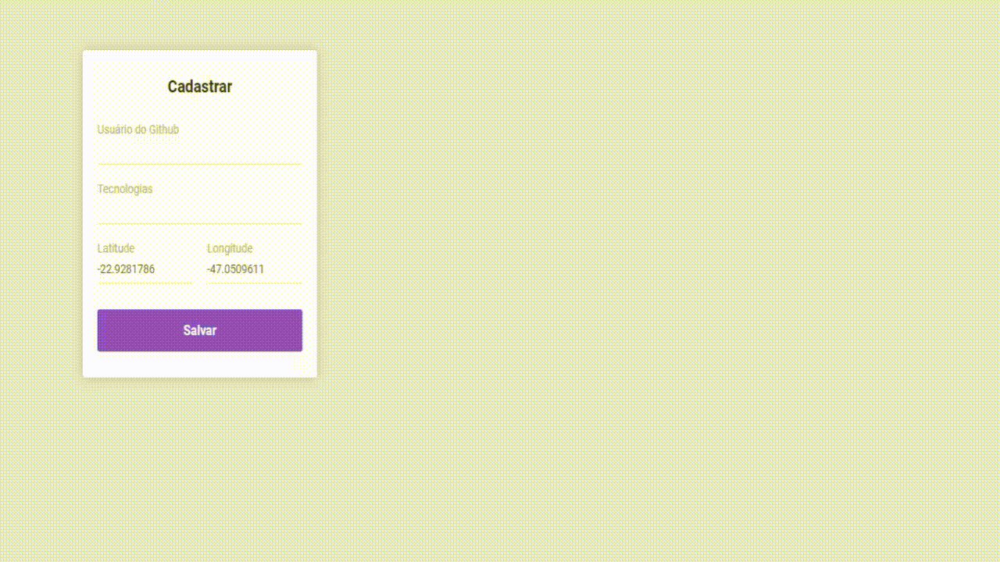

<h1 align="center">
<br>
  
<br>
<br>
DevRadar
</h1>

<p align="center">quer saber os desenvolvedores perto de você de acordo com algumas tecnologias? Esse é o app ideal.</p>

[//]: # "Add your gifs/images here:"

<div style="display: flex; justify-content: space-around;">
  
  
</div>

<hr />

## :computer: Tecnologias

[//]: # "Add the features of your project here:"

Essa aplicação usa as tecnologias mais atuais do mercado.

- ⚛️ **[React JS](https://reactjs.org/)** — Uma biblioteca JavaScript para criar interfaces de usuário
- ⚛️ **[React Native](https://reactnative.dev/)** — Uma biblioteca JavaScript que permite criar aplicativos nativod para Android e iOS
- 💹 **[Node JS](https://nodejs.org/en/)** — Uma biblioteca que executa javascript fora do navegador
- ::floppy_disk: **[MongoDB](https://www.mongodb.com/)** - O banco de dados para aplicativos modernos

## :fire: Instalação

Você precisa ter:

- NodeJS em qualquer versão **acima de 10**
  - [Instalar node](https://nodejs.org/pt-br/download/)
- Um gerenciador de pacotes node (npm ou yarn)
  - [Instalar npm]() _aqui você pode instalar o node junto com o npm_
  - [Instalar yarn](https://classic.yarnpkg.com/en/docs/install/#windows-stable) Clicar no botão 'Download Installer'
- MongoDB instalado localmente.
  - [Instalar mongoDB](https://www.mongodb.com/try/download/community) Clicar no botão 'Download'
- O seu dispositvo móvel deverá ter o aplicativo do Expo
  - [Expo Google Play](https://play.google.com/store/apps/details?id=host.exp.exponent)
  - [Expo App Store](https://apps.apple.com/br/app/expo-client/id982107779)

##### 1° :bookmark_tabs: Clone o repositório:

```sh
  $ git clone https://github.com/Carradori/dev-radar.git
```

##### 2° :heavy_check_mark: Iniciando a aplicação:

- Iniciando o backend

```sh
  # entre na pasta do backend
  $ cd ./backend

  # execute esse código no terminal (ele irá instalar todas as dependências)
  $ yarn add
  ou
  $ npm i

  # inicie o servidor
  $ yarn dev
  ou
  $ npm run dev
```

- Iniciando o front-end web

```sh
  # entre na pasta web
  $ cd ./web

  # execute esse código no terminal (ele irá instalar todas as dependências)
  $ yarn add
  ou
  $ npm i

  # inicie o app web
  $ yarn start
  ou
  $ npm start
```

- Iniciando o front-end mobile

```sh
  # entre na pasta mobile
  $ cd ./mobile

  # vá até src/services/api.js e socket.js
  $ cd ./src/services
  # nos arquivos api.js e socket.js - trocar onde estiver escrito "seu_ip_aqui" para o ip fixo da máquina

  # execute esse código no terminal (ele irá instalar todas as dependências)
  $ yarn add
  ou
  $ npm i

  # inicie o app mobile
  $ expo start
  ou
  $ yarn start
  ou
  $ npm start

  #Em seu dispotivo móvel, abra o app Expo e aponte a camera no QR Code que o site disponibiliza
```

## :large_blue_diamond: Algumas tecnologias e bibliotecas usadas

- Express
- Mongoose
- API do github
- Socket io
- Axios
